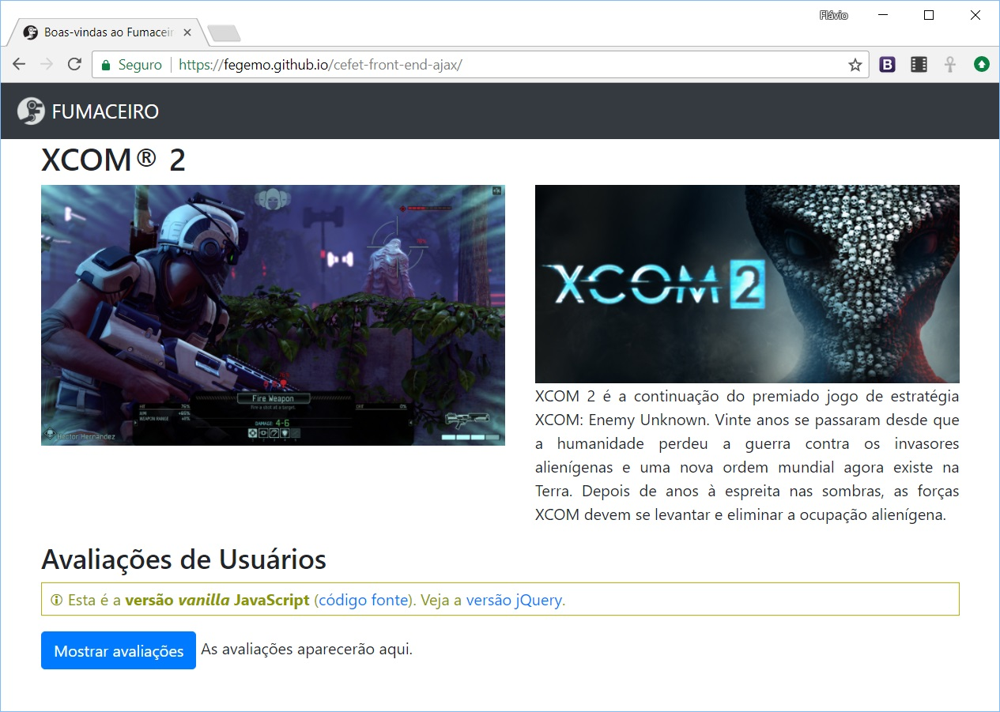

# FUMACEIRO

Este repositório contém um exemplo que demonstra o uso de Ajax para carregar
um arquivo `.json` após a página ter sido carregada.

Veja o [exemplo usando _vanilla_ JavaScript][vanilla] (JavaScript "puro",
sem o uso de bibliotecas) e o outro [exemplo usando jQuery][jquery].

[vanilla]: https://willsallum.github.io/cefet_front_end_ajax/
[jquery]: https://willsallum.github.io/cefet_front_end_ajax/index-jquery.html
